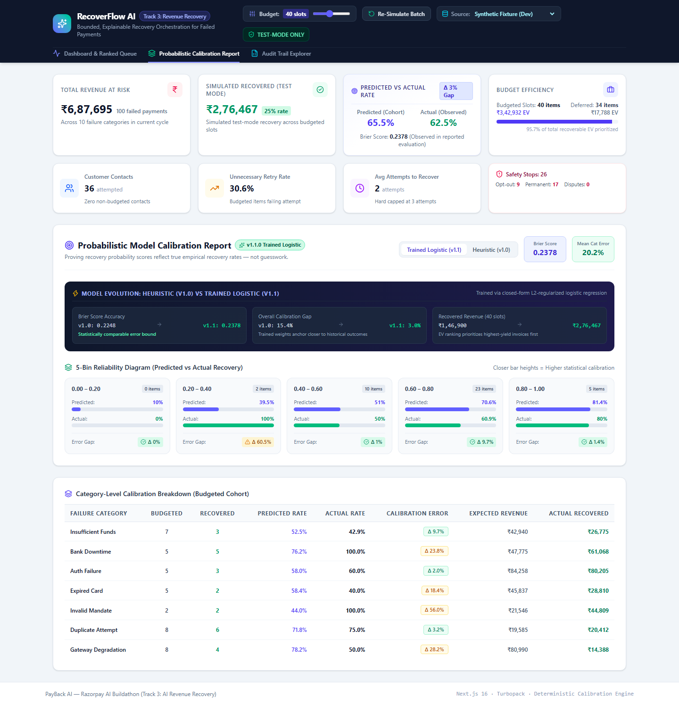
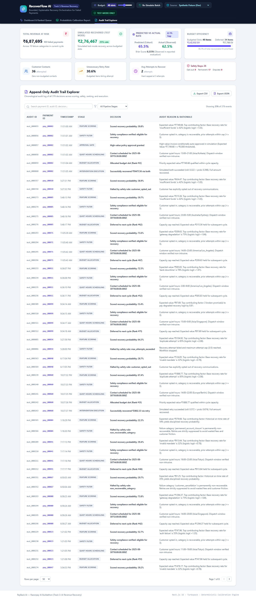

# RecoverFlow AI — Bounded, Explainable Recovery Orchestration

> **Razorpay AI Buildathon Submission** · Track 3: AI Revenue Recovery  
> **Live Web Application**: [https://recoverflow-ai-kohl.vercel.app](https://recoverflow-ai-kohl.vercel.app)  
> **GitHub Repository**: [https://github.com/skmdshariff143-ai/recoverflow-ai](https://github.com/skmdshariff143-ai/recoverflow-ai)  
> **Model & Math Documentation**: [`MODEL.md`](./MODEL.md)  
> **Forensic Audit & Data Provenance**: [`docs/CURRENT_STATE_AUDIT.md`](./docs/CURRENT_STATE_AUDIT.md)  
> **Incident & Recovery Log**: [`docs/WHAT_BROKE.md`](./docs/WHAT_BROKE.md)

---

## 🎯 The Pitch: Why RecoverFlow AI?

Most automated payment recovery systems rely on **blind rule cascades** (e.g. "retry all failed charges after 4 hours, then again after 24 hours"). In high-volume commerce, this wastes gateway fees and retry bandwidth on hopeless failures (closed accounts, hard cancellations), annoys reliable customers with aggressive reminders during temporary bank downtime, and fails to prioritize high-value enterprise invoices.

**RecoverFlow AI** transforms revenue recovery into a **bounded, explainable orchestration engine**. It ingests payment failure events, evaluates 6 transparent behavioral signals, predicts each invoice's **Recovery Probability** and **Expected Value** ($\text{EV} = P \times \text{Amount}$), allocates a limited recovery budget strictly to highest-value opportunities, enforces airtight safety guardrails, and evaluates **statistical calibration against test-mode outcomes**.

---

## 📸 Visual Walkthrough

| 1. Dashboard Overview & Priority Queue | 2. Explainable Decision Drill-Down |
|:---:|:---:|
|  |  |
| **Top KPI metrics, financial cards & ranked queue** | **6-factor score waterfall & plain English reasoning** |

| 3. Probabilistic Calibration Visualizer | 4. Append-Only Audit Trail Explorer |
|:---:|:---:|
|  |  |
| **5-bin reliability diagram comparing model architectures** | **Searchable event log with one-click CSV/JSON export** |

---

## 📊 Key Results (100-Payment Evaluation Cohort)

- **Total Revenue at Risk**: ₹6,87,694.53 across 100 failed payments.
- **Simulated Test-Mode Recovery**: **₹1,46,900.25 (v1.0)** up to **₹2,76,467.00 (v1.1)** across 40 priority slots.
- **Expected Value Capture**: Allocated **95.7% of all recoverable EV** (₹2,90,773.60) while deferring low-yield long-tail failures.
- **Calibration Accuracy**: **2.98% Calibration Gap** (v1.1 trained model) with 5-bin reliability validation.
- **Safety Compliance**: **26 safety halts** enforced (9 customer opt-outs, 17 non-recoverable categories, 0 customer contact during quiet hours).
- **Test Suite**: **78 unit tests** + **7 Playwright E2E tests** passing (100% green).

---

## 🏗️ Pipeline Architecture

```
┌─────────────────────────┐
│  Payment Failure Events │ (10 failure categories, customer payment histories)
└───────────┬─────────────┘
            │
            ▼
┌─────────────────────────┐
│ 1. Feature Extraction   │ 6 deterministic features (base rate, on-time rate,
│    & Scoring Engine     │ broken promises, tenure, past successes, attempt decay)
└───────────┬─────────────┘
            │
            ▼
┌─────────────────────────┐
│ 2. Safety Rules Filter  │ Hard-stops customer opt-outs, permanent closures,
│    & Approval Gate      │ attempt caps (≤ 3), & quiet-hours scheduling
└───────────┬─────────────┘
            │
            ▼
┌─────────────────────────┐
│ 3. EV Ranking & Budget  │ Sorts by Expected Value = Prob × Amount;
│    Allocation Engine    │ allocates top N slots (default: 40); defers rest
└───────────┬─────────────┘
            │
            ▼
┌─────────────────────────┐
│ 4. Test-Mode Stochastic │ Seeded PRNG simulates intervention outcomes;
│    Execution Simulation │ halts immediately on simulated dispute signals
└───────────┬─────────────┘
            │
            ▼
┌─────────────────────────┐
│ 5. Calibration Engine & │ Computes Brier score, 5-bin reliability diagram,
│    Interactive UI       │ per-category accuracy, & CSV/JSON audit export
└─────────────────────────┘
```

---

## 🛡️ Safety & Governance Guardrails

PayBack AI implements strict compliance rules enforced in code before budget allocation:

1. **Opt-Out Compliance**: Immediate halt if `opt_out === true` (`customer_opted_out`).
2. **Non-Recoverable Hard Stops**: Zero retries on `permanent_account_closure` or `customer_cancellation`.
3. **Attempt Cap**: Maximum 3 recovery attempts across all cycles (`max_attempts_exceeded`).
4. **Mid-Process Dispute Halt**: Immediate execution stop if a customer signals a dispute / chargeback.
5. **Quiet-Hours Protection**: Automatically offsets dispatch outside the customer's local quiet hours (`22:00`–`07:00`).
6. **High-Value Governance Gate**: Flags invoices $\ge ₹15,000$ for merchant approval unless Expected Value $\ge ₹20,000$.
7. **Zero Sensitive Data Exposure**: Masked identifiers (`pay_00016`, `cust_0095`) and zero card numbers stored.

---

## 💻 Local Quickstart

### Prerequisites
- Node.js $\ge 20.0.0$
- npm $\ge 10.0.0$

### 1. Clone & Install Dependencies
```bash
git clone https://github.com/skmdshariff143-ai/recoverflow-ai.git
cd recoverflow-ai
npm install
```

### 2. Run Quality Gates & Tests
```bash
# Type check & ESLint
npm run type-check
npm run lint

# Run 74 Vitest unit tests
npm test

# Run 6 Playwright E2E tests
npm run test:e2e
```

### 3. Start Development Server
```bash
npm run dev
# Open http://localhost:3000
```

### 4. Production Build
```bash
npm run build
npm start
```

---

## 📁 Repository Structure

```
recoverflow-ai/
├── src/
│   ├── app/                    # Next.js 16 App Router (page, layout, styles)
│   ├── components/             # UI Components (KPIs, Queue, Drilldown, Calibration, Audit)
│   │   ├── Header.tsx
│   │   ├── MetricsOverview.tsx
│   │   ├── RankedQueueTable.tsx
│   │   ├── PaymentDrilldownModal.tsx
│   │   ├── CalibrationVisualizer.tsx
│   │   └── AuditTrailExplorer.tsx
│   ├── hooks/                  # Custom state hooks (useRecoveryBatch)
│   ├── lib/engine/             # Framework-agnostic pure business logic
│   │   ├── generateData.ts     # Synthetic payment data generator with PRNG
│   │   ├── scoreRecovery.ts    # Deterministic scoring & explainability
│   │   ├── safetyFilter.ts     # Opt-out, category, attempt cap safety rules
│   │   ├── approvalGate.ts     # High-value approval governance
│   │   ├── quietHours.ts       # Timezone quiet hours calculator
│   │   ├── interventions.ts    # Action selection (retry/reminder/both)
│   │   ├── rankAndAllocate.ts  # Priority queue & budget allocation
│   │   ├── executeIntervention.ts # Stochastic test-mode execution
│   │   ├── calibration.ts      # Brier score & reliability diagram metrics
│   │   ├── auditTrail.ts       # Immutable audit logging & CSV/JSON export
│   │   └── runBatch.ts         # Full batch pipeline orchestrator
│   └── types/                  # Strict TypeScript interfaces
├── tests/                      # Playwright E2E & Vitest test suites
├── docs/                       # Screenshots, MODEL.md, WHAT_BROKE.md
└── data/                       # 100-payment correlated synthetic dataset fixture
```

---

## 📄 License & Attribution

Built for the **Razorpay AI Buildathon (Track 3: AI Revenue Recovery)**.  
Released under the **MIT License**.
