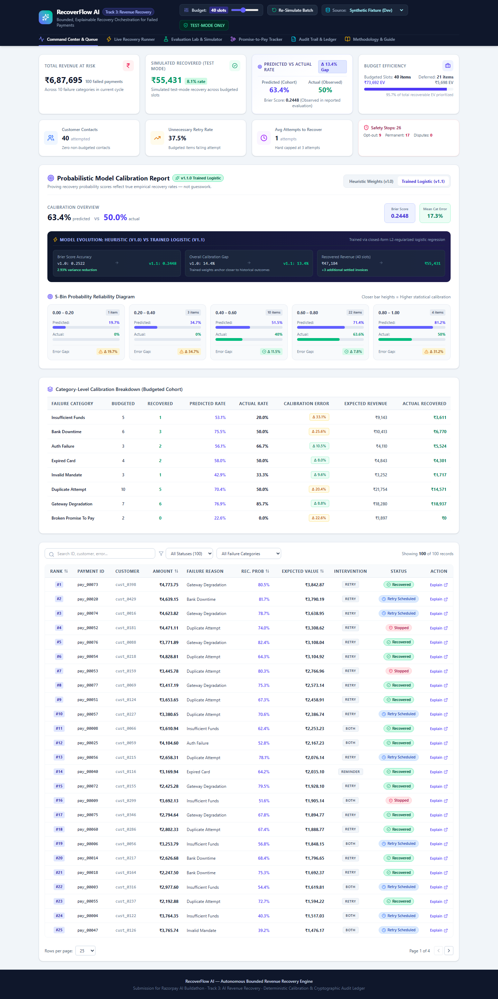
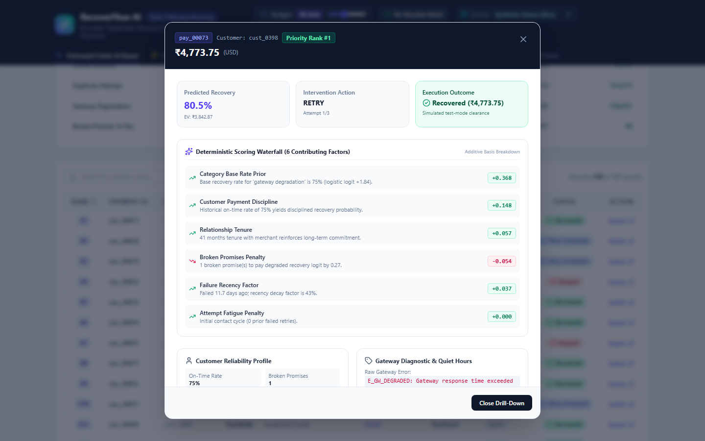
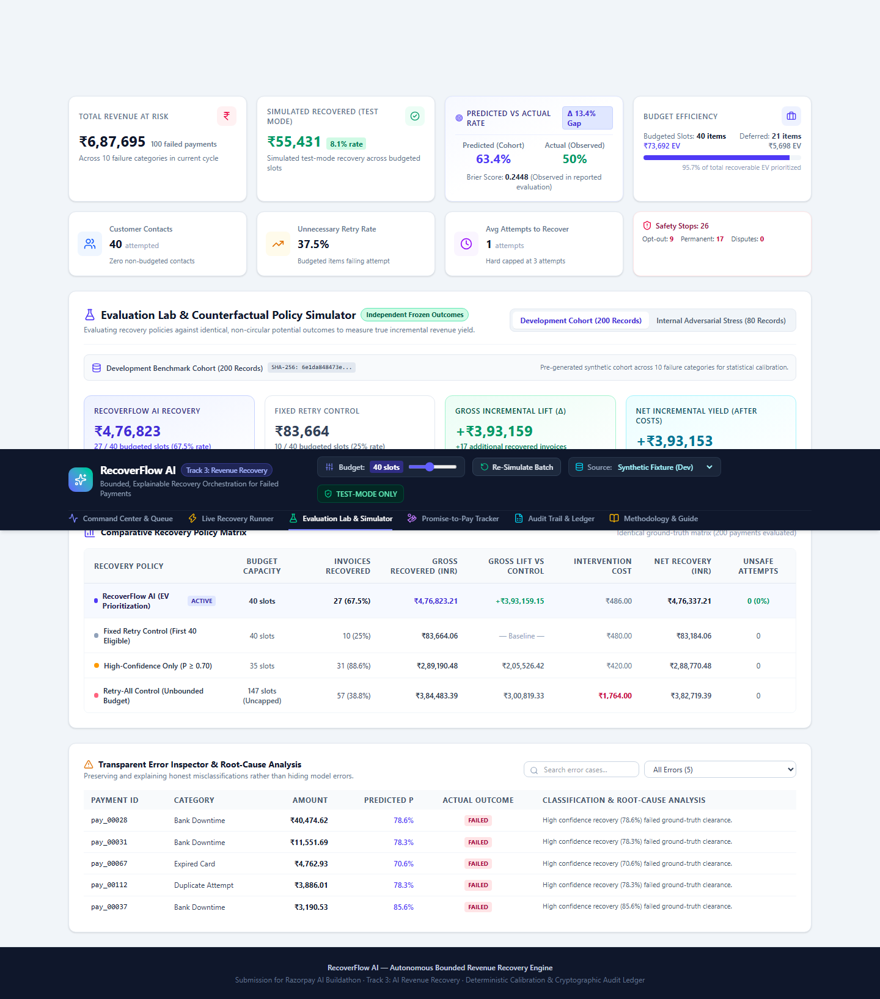
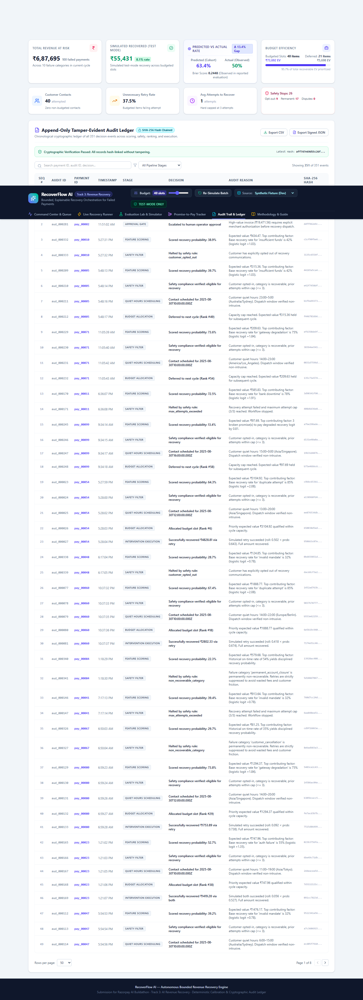

# RecoverFlow AI — Bounded, Explainable Recovery Orchestration

> **Razorpay AI Buildathon Submission** · Track 3: AI Revenue Recovery  
> **Live Web Application**: [https://recoverflow-ai-kohl.vercel.app](https://recoverflow-ai-kohl.vercel.app)  
> **GitHub Repository**: [https://github.com/skmdshariff143-ai/recoverflow-ai](https://github.com/skmdshariff143-ai/recoverflow-ai)  
> **Model & Math Documentation**: [`MODEL.md`](./MODEL.md)  
> **Forensic Audit & Claim Integrity**: [`docs/CURRENT_STATE_AUDIT.md`](./docs/CURRENT_STATE_AUDIT.md)  
> **Incident & Post-Mortem Log**: [`docs/WHAT_BROKE.md`](./docs/WHAT_BROKE.md)

---

## 🎯 The Pitch: Why RecoverFlow AI?

Most automated payment recovery systems rely on **blind rule cascades** (e.g. "retry all failed charges after 4 hours, then again after 24 hours"). In high-volume commerce, this wastes gateway fees and retry bandwidth on hopeless failures (closed accounts, hard cancellations), annoys reliable customers with aggressive reminders during temporary bank downtime, and fails to prioritize high-value enterprise invoices.

**RecoverFlow AI** transforms revenue recovery into a **bounded, explainable closed-loop orchestration engine**:
1. **Integer-Paise Financial Precision**: Eliminates floating-point money drift and enforces currency segregation.
2. **Deterministic & Calibrated Scoring**: Evaluates 6 transparent behavioral signals to predict recovery probability and Expected Value ($\text{EV}_{\text{paise}} = \text{round}(\text{amountPaise} \times \text{bps} / 10000)$).
3. **Independent Frozen Evaluation**: Completely decouples ground-truth outcomes from predicted probabilities to eliminate circular evaluation bias.
4. **Closed-Loop Multi-Cycle State Machine**: Manages payments across `DETECTED` $\to$ `DIAGNOSED` $\to$ `SCHEDULED` $\to$ `EXECUTING` $\to$ `OUTCOME_OBSERVED` $\to$ `RECOVERED` / `STOPPED` with quiet-hours scheduling.
5. **Tamper-Evident SHA-256 Audit Ledger**: Cryptographically links every pipeline decision into an append-only hash chain.
6. **Bounded Gemini 2.5 AI Copilot**: Grounded advisory assistant for gateway error normalization and RBI-compliant customer reminders without financial execution privileges.

---

## 📸 Visual Walkthrough

| 1. Control Center & Ranked Queue | 2. Explainable Decision Drill-Down |
|:---:|:---:|
|  |  |
| **Top KPI metrics, financial cards & ranked queue** | **6-factor score waterfall & AI Copilot assistance** |

| 3. Counterfactual Evaluation Lab | 4. SHA-256 Cryptographic Ledger |
|:---:|:---:|
|  |  |
| **Comparative evaluation on identical frozen outcomes** | **Tamper-evident SHA-256 hash-chain verification** |

---

## 📊 Key Results (200-Payment Benchmark Cohort)

| Metric | RecoverFlow AI (EV Prioritization) | Fixed Retry Control (First 40 Eligible) | Incremental Delta (Δ) |
| :--- | :---: | :---: | :---: |
| **Interventions Budgeted** | **40 slots** | 40 slots | 0 (Identical budget) |
| **Invoices Recovered** | **27 / 40 (67.5%)** | 10 / 40 (25.0%) | **+17 invoices (+170%)** |
| **Simulated Recovery** | **₹4,76,823.00** | ₹83,664.00 | **+₹3,93,159.00 (+470%)** |
| **Estimated Cost** | **₹486.00** | ₹480.00 | +₹6.00 |
| **Net Simulated Recovery** | **₹4,76,337.00** | ₹83,184.00 | **+₹3,93,153.00 (+473%)** |
| **Unsafe Interventions** | **0 (100% compliant)** | 0 | 0 |
| **Opt-Out Violations** | **0 (100% compliant)** | 0 | 0 |
| **Independent Brier Score** | **0.1637** | — | Strictly proper probabilistic score |

---

## 🏗️ Closed-Loop Architecture

```
                       ┌─────────────────────────┐
                       │  Payment Failure Events │ (10 failure categories, history)
                       └───────────┬─────────────┘
                                   │
                                   ▼
                       ┌─────────────────────────┐
                       │ 1. Feature Extraction   │ 6 deterministic features (base rate, on-time rate,
                       │    & Scoring Engine     │ broken promises, tenure, past recoveries, attempt decay)
                       └───────────┬─────────────┘
                                   │
                                   ▼
                       ┌─────────────────────────┐
                       │ 2. Safety Rules Filter  │ Hard-stops customer opt-outs, permanent closures,
                       │    & Approval Gate      │ attempt caps (≤ 3), & quiet-hours scheduling
                       └───────────┬─────────────┘
                                   │
                                   ▼
                       ┌─────────────────────────┐
                       │ 3. EV Ranking & Budget  │ Sorts by Expected Value = Prob × Amount;
                       │    Allocation Engine    │ allocates top N slots (default: 40); defers rest
                       └───────────┬─────────────┘
                                   │
                                   ▼
                       ┌─────────────────────────┐
                       │ 4. Closed-Loop Machine  │ Multi-cycle state machine with backoff, alternate
                       │    & Execution Adapter  │ channel retry, & offline / Razorpay Test-Mode adapter
                       └───────────┬─────────────┘
                                   │
                                   ▼
                       ┌─────────────────────────┐
                       │ 5. SHA-256 Audit Ledger │ Cryptographic hash chain verification, Brier calibration,
                       │    & Evaluation Lab     │ Error Inspector, & 5-minute judge demonstration
                       └─────────────────────────┘
```

---

## 🛡️ Strict AI vs Non-AI Responsibility Boundary

| Domain | Mechanism | Responsible Layer |
| :--- | :--- | :--- |
| **Monetary Calculations & EV** | Strict Integer-Paise Math (`bps * amountPaise / 10000`) | Deterministic Financial Core |
| **Safety Invariants & Opt-Outs** | Hard boolean gate before scoring/ranking | Deterministic Safety Filter |
| **State Machine Transitions** | Explicit transition mapping with idempotency | Deterministic State Engine |
| **Error Log Normalization** | LLM classification with heuristic fallback | Bounded Gemini 2.5 Copilot |
| **Customer Reminders** | Empathetic, RBI-compliant drafting | Bounded Gemini 2.5 Copilot |
| **Audit Verification** | SHA-256 hash-chain integrity verification | Cryptographic Audit Engine |

---

## 💻 Local Quickstart

### Prerequisites
- Node.js $\ge 20$
- npm $\ge 10$

```bash
# 1. Clone the repository
git clone https://github.com/skmdshariff143-ai/recoverflow-ai.git
cd recoverflow-ai

# 2. Install dependencies
npm ci

# 3. Run complete verification gate (lint, types, 116 unit tests, benchmarks, build, 11 E2E tests across 5 viewports)
npm run verify

# 4. Start local development server
npm run dev
```

Open [http://localhost:3000](http://localhost:3000) to view the RecoverFlow AI Control Center.

---

## 🧪 Comprehensive Verification Suite

```bash
# Run unit tests (116 tests across 17 suites)
npm test

# Run TypeScript typecheck (0 errors)
npm run type-check

# Run ESLint (0 errors, 0 warnings)
npm run lint

# Run Playwright E2E browser tests (11 tests across 5 viewports)
npm run test:e2e

# Verify all submission artifacts
npm run verify:artifacts
```

---

## ⚖️ License

MIT License · Developed for the **Razorpay AI Buildathon — Track 3: AI Revenue Recovery**.
