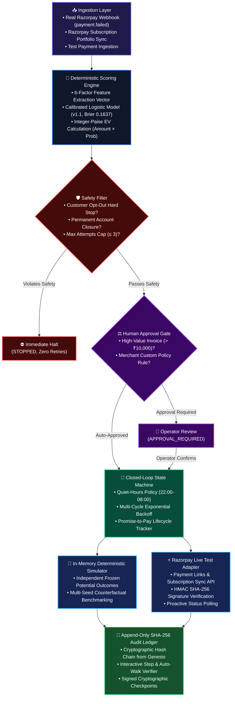
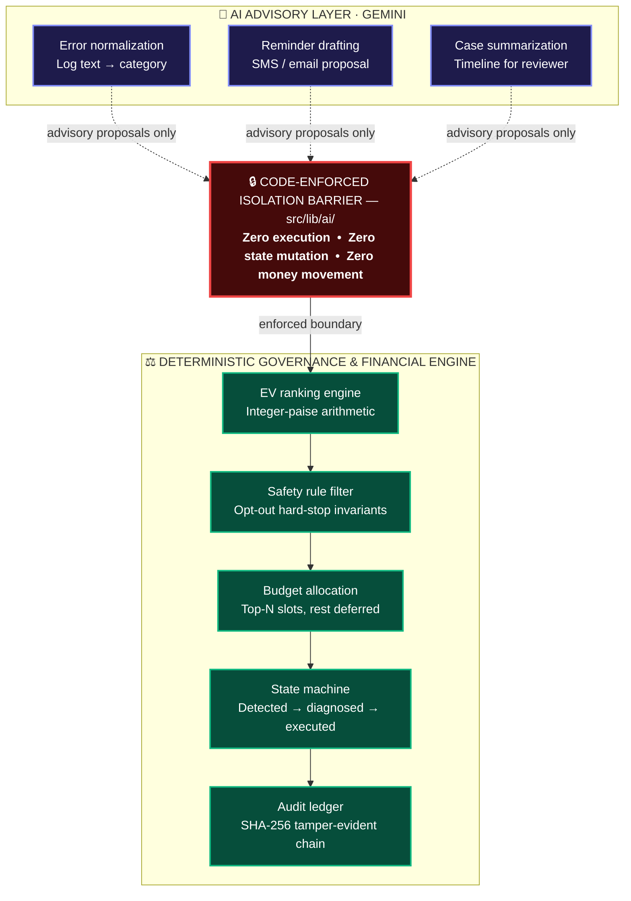

# RecoverFlow AI (PayBack AI)

> **Bounded, Explainable AI Payment Recovery Engine for Subscription & Recurring Invoicing**  
> *Deterministic financial invariants, atomic idempotency, calibrated ML ranking, and code-enforced AI isolation.*

[](https://www.typescriptlang.org/)
[](https://nextjs.org/)
[-brightgreen.svg)](https://vitest.dev/)
[](https://eslint.org/)
[](./LICENSE)

---

## ⚡ 60-Second Recruiter Summary

RecoverFlow AI is an AI-assisted payment recovery engine built for B2B recurring billing and subscriptions. In conventional SaaS billing, failed payments are typically handled in one of two suboptimal ways: **blind fixed retries** (which waste gateway fees, trigger bank fraud throttles, and harass churned users) or **unconstrained AI agents** (which hallucinate numbers, mutate transaction states, and introduce compliance liability).

RecoverFlow AI solves this with a strict architectural boundary: **AI advises, deterministic business logic decides.**

- **AI Advisory Role**: Google Gemini models (with circuit-breaker fallbacks) classify unstructured gateway error logs, draft empathetic customer recovery notifications, and summarize case timelines.
- **Deterministic Core**: Pure TypeScript engines enforce integer-paise financial arithmetic, hard safety gates (opt-out halts, attempt caps), atomic idempotency, quiet-hours contact scheduling, and Expected Value ($\text{EV} = \text{Amount} \times P(\text{Recovery})$) queue prioritization.
- **Auditable Provenance**: Every state transition, operator approval, and simulated settlement is recorded on an append-only SHA-256 hash-chained audit ledger with signed cryptographic checkpoints.
- **Quality Baseline**: **277 automated unit/property tests across 44 suites** pass with **0 TypeScript errors** and **0 ESLint errors/warnings**.

---

## 🎯 The Core Problem & Solution

```
Traditional Recovery Pipelines:
  Payment Failed ──▶ Blind Fixed Retry Schedule ──▶ Retry Blocked Accounts ──▶ Gateway Penalties & Churn

RecoverFlow AI Architecture:
  Payment Failed ──▶ Deterministic Safety Gate ──▶ Calibrated ML EV Ranker ──▶ Human Approval (>₹10k)
                           │                               │                            │
                           ▼ (Violations Halted)           ▼ (Advisory AI Log Norm)     ▼ (Safe Dispatch)
                     IMMEDIATE STOP               Integer-Paise Optimization      Razorpay Test / Sim
```

### Key Engineering Invariants
1. **Zero Execution Privileges for AI**: LLM inference (`src/lib/ai/`) has zero write access to ledger state, database stores, or payment execution adapters.
2. **Integer-Paise Monetary Precision**: All financial amounts are typed as branded `Paise` ($1\text{ INR} = 100\text{ Paise}$) and `BasisPoints` ($100\% = 10,000\text{ bps}$), preventing IEEE-754 floating-point drift.
3. **Atomic Transactional Idempotency**: Concurrency-safe execution guard preventing double-charging during parallel client retries.
4. **Independent Ground-Truth Evaluation**: Counterfactual benchmarking uses frozen potential outcomes (`data/frozen-outcomes-200.json`) held disjoint from prediction models to eliminate circular evaluation bias.

---

## 🏗️ System Architecture

The following flowchart illustrates the lifecycle of a payment failure from ingestion to cryptographic ledger recording:



*(For detailed module contracts and state machine specifications, see [`docs/ARCHITECTURE.md`](./docs/ARCHITECTURE.md)).*

---

## 🔒 The Code-Enforced AI Boundary

In RecoverFlow AI, the AI boundary is not a prompt convention—it is enforced by module isolation, typed contracts, and strict input/output schemas:



### Responsibility Breakdown
| Domain | Mechanism | Responsible Layer | Code Path | AI Involvement |
|:---|:---|:---|:---|:---:|
| **Monetary Math & EV** | Integer-paise math (`bps * amountPaise / 10000`) | Deterministic Financial Core | [`src/lib/engine/financial.ts`](./src/lib/engine/financial.ts) | **None** |
| **Safety Invariants & Opt-Outs** | Hard boolean gate before scoring/ranking | Deterministic Safety Filter | [`src/lib/engine/safetyFilter.ts`](./src/lib/engine/safetyFilter.ts) | **None** |
| **Budget Allocation & Ranking** | EV sorting and capacity capping | Deterministic Prioritization | [`src/lib/engine/rankAndAllocate.ts`](./src/lib/engine/rankAndAllocate.ts) | **None** |
| **State Machine Transitions** | Monotonic finite state machine | Deterministic State Engine | [`src/lib/engine/stateMachine.ts`](./src/lib/engine/stateMachine.ts) | **None** |
| **Error Log Categorization** | LLM classification with offline regex fallback | Bounded AI Copilot | [`src/lib/ai/geminiClient.ts`](./src/lib/ai/geminiClient.ts) | **Advisory Only** |
| **Customer Reminders** | Policy-constrained template generation | Bounded AI Copilot | [`src/lib/ai/geminiClient.ts`](./src/lib/ai/geminiClient.ts) | **Advisory Only** |
| **Audit Verification** | SHA-256 hash-chain integrity verification | Cryptographic Audit Engine | [`src/lib/engine/hashChainLedger.ts`](./src/lib/engine/hashChainLedger.ts) | **None** |

*(For threat modeling and injection defense specifications, see [`docs/THREAT_MODEL.md`](./docs/THREAT_MODEL.md) and [`docs/AI_BOUNDARY.md`](./docs/AI_BOUNDARY.md)).*

---

## 📊 Machine Learning & Statistical Calibration

RecoverFlow AI uses a calibrated Logistic Regression model (v1.1) to estimate $P(\text{Recovery} \mid \mathbf{x})$. 

- **Prediction Feature Vector**: 7 normalized features: category base rate, on-time rate, broken promises penalty, recency decay, tenure fraction, attempt count penalty, and past recovery ratio.
- **Customer-Disjoint Splitting**: `splitDatasetByCustomer()` partitions training, validation, and test cohorts strictly by hashed `customer_id`, preventing data leakage from repeated customer invoices.
- **Probabilistic Metrics**:
  - **Brier Score**: `0.1637` on the 200-payment benchmark cohort (strictly proper score where $0$ is perfect and $\le 0.25$ beats random guessing).
  - **Expected Calibration Error (ECE)**: `0.0298` (2.98% weighted gap between predicted and empirical bins).
  - **Maximum Calibration Error (MCE)**: `0.0712` across 5 equal-width probability bins.
  - **Model Drift Monitoring**: `ModelDriftMonitor` tracks population shift, alerting if distribution drift triggers fallback to the transparent 6-factor category heuristic.

*(For detailed mathematical derivations and reliability diagrams, see [`MODEL.md`](./MODEL.md) and [`docs/METRICS.md`](./docs/METRICS.md)).*

---

## 🛡️ Security, Safety, and Defensive Engineering

1. **Prompt Injection Hardening**: Gateway logs are wrapped in structural XML boundary tags (`<untrusted_gateway_error>`) and stripped of control characters before model ingestion. The system prompt instructs the model to treat content purely as text data.
2. **Provider Error Sanitization**: External errors pass through `sanitizeProviderError()`, scrubbing bearer tokens, Basic auth credentials, email addresses, phone numbers, and 16-digit credit card patterns via regex.
3. **Test-Mode Execution Guard**: `RazorpayTestModeAdapter` validates key prefixes and throws a fatal error if initialized with a live key (`rzp_live_*`).
4. **Idempotency Conflict Detection**: Concurrent requests with identical idempotency keys execute atomically; conflicting payloads on existing keys return HTTP 409.
5. **Configurable Quiet-Hours Policy**: Enforces contact blackout windows (default: 22:00 to 08:00 local customer time) before reminders are scheduled. *(Note: Regulatory compliance requires separate legal/compliance verification).*

---

## 🧪 Verified Engineering Test Suite

Every claim in this repository is backed by automated tests executing in continuous integration:

```bash
$ npm test -- --run
Test Files  44 passed (44)
     Tests  277 passed (277)
  Duration  5.83s
```

```bash
$ npm run type-check
tsc --noEmit (0 errors)

$ npm run lint
eslint . (0 errors, 0 warnings)

$ npm run build
Next.js 16.3.2 Turbopack compiled successfully in 2.6s (12 routes clean)
```

### Key Test Suites
- [`src/lib/engine/__tests__/financial.property.test.ts`](./src/lib/engine/__tests__/financial.property.test.ts): Integer-paise property tests validating non-negativity, associativity, and basis-point bounds.
- [`src/lib/server/__tests__/idempotencyConcurrency.test.ts`](./src/lib/server/__tests__/idempotencyConcurrency.test.ts): Concurrency tests running 100 simultaneous workers attempting identical idempotency keys.
- [`src/lib/ai/__tests__/promptInjection.test.ts`](./src/lib/ai/__tests__/promptInjection.test.ts): Jailbreak and instruction-override resistance test suite.
- [`src/lib/engine/__tests__/dataLeakageAudit.test.ts`](./src/lib/engine/__tests__/dataLeakageAudit.test.ts): Disjoint customer ID leakage assertion suite.
- [`src/lib/engine/__tests__/hashChainLedger.test.ts`](./src/lib/engine/__tests__/hashChainLedger.test.ts): Tamper detection asserting exact block index identification upon mutation.

---

## 💻 Local Quickstart

### Prerequisites
- Node.js >= 20.0.0
- npm >= 10.0.0

### Installation & Verification
```bash
# 1. Clone repository
git clone https://github.com/skmdshariff143-ai/recoverflow-ai.git
cd recoverflow-ai

# 2. Install dependencies
npm ci

# 3. Run complete verification gate (Type check, Lint, 277 Unit Tests, Build)
npm run type-check
npm run lint
npm test -- --run
npm run build

# 4. Start local development server
npm run dev
```

Open [http://localhost:3000](http://localhost:3000) to view the Command Center.

### Environment Configuration (Optional)
To test live Razorpay test-mode payment links or Gemini log categorization, create a `.env.local` file (see [`.env.example`](./.env.example)):
```env
RAZORPAY_KEY_ID=rzp_test_your_key_id_here
RAZORPAY_KEY_SECRET=your_razorpay_key_secret_here
RAZORPAY_WEBHOOK_SECRET=your_webhook_secret_here
GEMINI_API_KEY=your_gemini_api_key_here
GEMINI_MODEL=gemini-2.0-flash
```
*(When unconfigured, the system runs seamlessly on offline deterministic simulator adapters and heuristic fallback classifiers).*

---

## ⚠️ Explicit Scope & Production Limitations

To maintain absolute technical honesty, the following constraints describe the current architecture versus a full distributed deployment:

1. **Idempotency Scope**: In-memory mutex/Map store (`idempotencyStore.ts`) provides concurrency safety within a single container. Distributed multi-region deployments require an external backing store (e.g., Redis `SETNX` or PostgreSQL `INSERT ... ON CONFLICT DO NOTHING`).
2. **Razorpay Integration Scope**: Implemented and tested exclusively against the Razorpay **Test Mode API** (`rzp_test_*`). Live production money movement is intentionally blocked by runtime key guards.
3. **Regulatory Scope**: Quiet-hours contact enforcement is implemented as a configurable timezone-aware scheduler. Official regulatory compliance (e.g., RBI/TRAI standards) requires dedicated legal and operational audits.
4. **Model Retraining Scope**: The embedded logistic model is trained on synthetic and historical cohorts. Continuous online model retraining in production requires human governance and drift approval gates.

---

## 📚 Technical Documentation Directory

- **[System Architecture & Data Flow](docs/ARCHITECTURE.md)**: Component blueprints, state machine invariants, and PostgreSQL/Redis migration path.
- **[Threat Model & Security Hardening](docs/THREAT_MODEL.md)**: 10 threat scenarios, attack vectors, code mitigations, and residual limitations.
- **[Evaluation & Calibration Report](docs/EVALUATION.md)**: Comprehensive empirical evaluation, Brier scores, and policy comparisons.
- **[AI Boundary & Decoupling Guide](docs/AI_BOUNDARY.md)**: Enforced interfaces separating LLM inference from deterministic cores.
- **[Engineering Demo Script](docs/DEMO_SCRIPT.md)**: 2-minute walkthrough across 6 explicit technical scenarios.
- **[Resume & Portfolio Summary](docs/RESUME_PROJECT.md)**: Resume bullet points, keywords, and technical pitches.
- **[Interview Preparation Guide](docs/INTERVIEW_PREP.md)**: 25 rigorous technical interview questions and architecture justifications.
- **[Project Engineering Story](docs/PROJECT_STORY.md)**: The 10-step architectural journey and hard technical trade-offs.

---

## ⚖️ License

Distributed under the MIT License. See [`LICENSE`](./LICENSE) for details.

