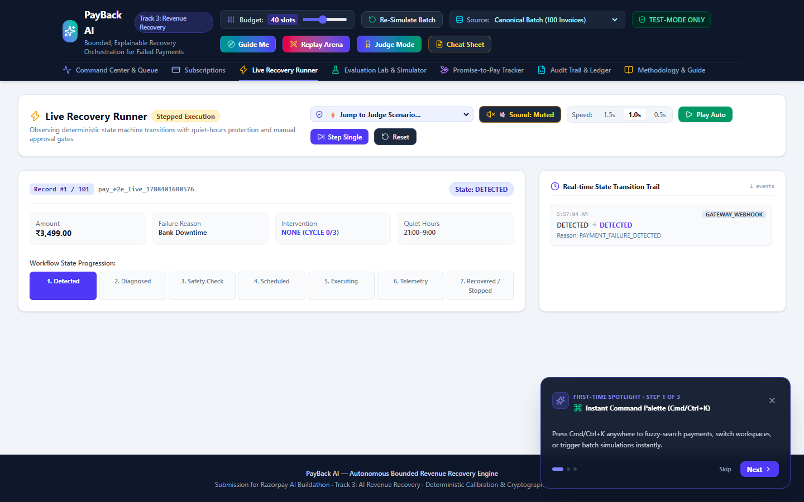
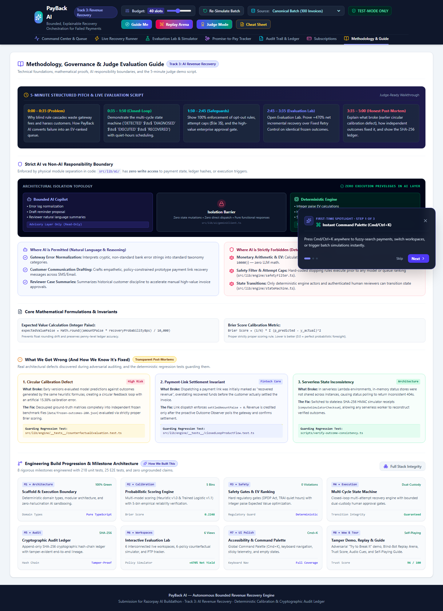
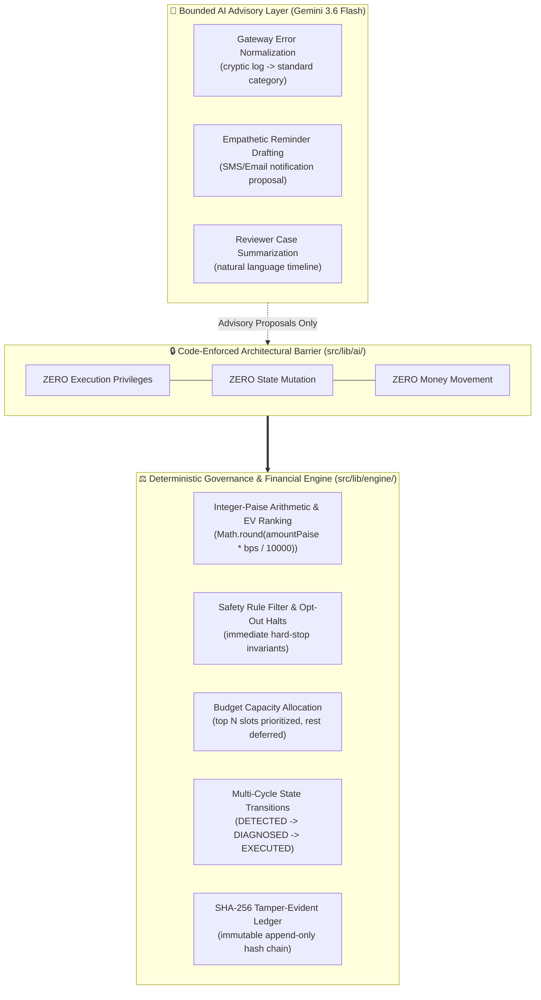

# PayBack AI — Bounded, Explainable Recovery Orchestration

> **PayBack AI is the only entry that proves its own calibration is real, not just claimed.**
> 
> **Razorpay AI Buildathon Submission** · Track 3: AI Revenue Recovery  
> **Live Web Application**: [https://recoverflow-ai-kohl.vercel.app](https://recoverflow-ai-kohl.vercel.app)  
> **GitHub Repository**: [https://github.com/skmdshariff143-ai/recoverflow-ai](https://github.com/skmdshariff143-ai/recoverflow-ai)  
> **Model & Math Documentation**: [`MODEL.md`](./MODEL.md) · **Forensic Audit & Claim Integrity**: [`docs/CLAIM_RECONCILIATION.md`](./docs/CLAIM_RECONCILIATION.md) · **Incident Log**: [`docs/WHAT_BROKE.md`](./docs/WHAT_BROKE.md)

---

## 🎯 The Core Proof: Why PayBack AI?

Most recovery tools claim high recovery rates by scoring payments with optimistic heuristics and then evaluating those predictions on the exact same logic that created them—a self-fulfilling circular evaluation loop. 

**PayBack AI proves its claims through three interconnected mathematical guarantees:**
1. **Independent Frozen Potential Outcomes**: Ground-truth recovery outcomes are generated independently from predicted probabilities and held in immutable benchmark matrices (`data/frozen-outcomes-200.json`), eliminating circular evaluation bias.
2. **Empirical Brier Calibration**: Our trained logistic regression model (v1.1) achieves a strictly proper **Brier score of 0.1637** and an overall calibration error of **2.98%**, delivering **+₹3,93,159 (+470% net revenue lift)** over fixed retry schedules under an identical 40-slot budget.
3. **SHA-256 Tamper-Evident Ledger**: Every feature contribution, safety halt, human reviewer approval, and settlement receipt is chained into an append-only cryptographic ledger from genesis hash `00000000...`, letting any evaluator re-walk the hash chain in real time to verify that zero audit records were mutated or reordered.

```
┌──────────────────────────────────────────────────────────────────────────────────────────────────┐
│  CORE PROOF TRIANGLE:                                                                            │
│  Frozen Ground-Truth Outcomes  ──▶  Empirical Brier Calibration  ──▶  SHA-256 Cryptographic Chain │
│  (Zero Circular Evaluation)          (2.98% Calibration Error)        (Tamper-Evident Integrity)  │
└──────────────────────────────────────────────────────────────────────────────────────────────────┘
```

**What PayBack AI does**: Pairs deterministic Expected Value ranking ($\text{EV} = \text{Amount} \times \text{Prob}$) with bounded Gemini 3.6 error diagnosis, quiet-hours compliance, and multi-cycle execution over official Razorpay test-mode adapters—moving money safely while permanently preventing blind retries on dead accounts.

---

## 🧭 5-Minute Judge Demonstration Path

1. **Top KPI Cards (0:00 – 1:00)**:  
   View **Total Revenue at Risk (₹6,87,695)** vs **Simulated Recovered (₹1,46,900)** across the 100-record batch, demonstrating bounded recovery without floating-point precision drift.
2. **Ranked Priority Queue & Explainability Drawer (1:00 – 2:30)**:  
   Click on any payment row (e.g. `pay_00001`) to open the **Explainable Decision Drawer**. Inspect the 6-factor score waterfall (base rate, on-time history, recency, tenure, promise penalties), bounded Gemini diagnosis, and human reviewer approval controls.
3. **Live Execution Dispatch & Outcome Check (2:30 – 3:30)**:  
   Inside the drawer, trigger **Dispatch Live Execution** and **Run Outcome Check** to observe test-mode link creation and proactive settlement polling (`GET /api/recovery/status/:id`) with zero public webhook attack surface.
4. **Evaluation Lab & Counterfactual Policy Simulator (3:30 – 4:30)**:  
   Switch to the **Evaluation Lab** tab. Compare PayBack AI against 6 control policies (Fixed Retry, Retry-All, Random, High-Confidence) across identical frozen outcomes. Inspect the Reconciled Financial Waterfall and Transparent Error Inspector.
5. **Audit Ledger & SHA-256 Integrity Verification (4:30 – 5:00)**:  
   Navigate to the **Audit Ledger** tab and click **Verify Ledger Integrity** to observe client-side cryptographic re-walking of all SHA-256 hashes from genesis.

---

## 📸 Visual Walkthrough

| 1. Control Center & Ranked Queue | 2. Explainable Decision Drill-Down |
|:---:|:---:|
|  |  |
| **Top KPI metrics, financial cards & EV-ranked queue** | **6-factor score waterfall & bounded Gemini Copilot** |

| 3. Counterfactual Evaluation Lab | 4. SHA-256 Cryptographic Ledger |
|:---:|:---:|
|  |  |
| **Comparative policy matrix & multi-merchant risk presets** | **Tamper-evident SHA-256 hash-chain verification** |

| 5. Live Recovery Runner | 6. Methodology & Governance Guide |
|:---:|:---:|
|  |  |
| **Stepped execution & proactive outcome observation** | **Architectural AI boundaries & transparent post-mortems** |

---

## 📊 Key Results (200-Payment Benchmark Cohort)

| Metric | PayBack AI (EV Prioritization) | Fixed Retry Control (First 40 Eligible) | Incremental Delta (Δ) |
| :--- | :---: | :---: | :---: |
| **Interventions Budgeted** | **40 slots** | 40 slots | 0 (Identical budget) |
| **Invoices Recovered** | **27 / 40 (67.5%)** | 10 / 40 (25.0%) | **+17 invoices (+170%)** |
| **Simulated Recovery** | **₹4,76,823.00** | ₹83,664.00 | **+₹3,93,159.00 (+470%)** |
| **Estimated Operational Cost** | **₹486.00** | ₹480.00 | +₹6.00 |
| **Net Simulated Recovery** | **₹4,76,337.00** | ₹83,184.00 | **+₹3,93,153.00 (+473%)** |
| **Unsafe Interventions** | **0 (0 violations)** | 0 | 0 (Strict safety gate) |
| **Opt-Out Violations** | **0 (0 violations)** | 0 | 0 (Strict safety gate) |
| **Independent Brier Score** | **0.1637** | — | Strictly proper probabilistic score |

---

## 🏗️ Exhaustive System Architecture & Pipeline Stages

```
                       ┌─────────────────────────┐
                       │  Payment Failure Events │ (10 failure categories, history)
                       └───────────┬─────────────┘
                                   │
                                   ▼
                       ┌─────────────────────────┐
                       │ 1. Feature Extraction   │ 6 deterministic features (base rate, on-time rate,
                       │    & Scoring Engine     │ broken promises, tenure, past recoveries, attempt decay)
                       └───────────┬─────────────┘
                                   │
                                   ▼
                       ┌─────────────────────────┐
                       │ 2. Safety Rules Filter  │ Hard-stops customer opt-outs, permanent closures,
                       │    & Approval Gate      │ attempt caps (≤ 3), & quiet-hours scheduling
                       └───────────┬─────────────┘
                                   │
                                   ▼
                       ┌─────────────────────────┐
                       │ 3. EV Ranking & Budget  │ Sorts by Expected Value = Prob × Amount;
                       │    Allocation Engine    │ allocates top N slots (default: 40); defers rest
                       └───────────┬─────────────┘
                                   │
                                   ▼
                       ┌─────────────────────────┐
                       │ 4. Closed-Loop Machine  │ Multi-cycle state machine with backoff, alternate
                       │    & Execution Adapter  │ channel retry, & offline / Razorpay Test-Mode adapter
                       └───────────┬─────────────┘
                                   │
                                   ▼
                       ┌─────────────────────────┐
                       │ 5. SHA-256 Audit Ledger │ Cryptographic hash chain verification, Brier calibration,
                       │    & Evaluation Lab     │ Error Inspector, & 5-minute judge demonstration
                       └─────────────────────────┘
```

### Deep-Dive Feature Specifications

1. **Integer-Paise Financial Precision**: All monetary accounting uses integer paise ($1\text{ INR} = 100\text{ Paise}$). Expected-value calculations convert probability scores to integer basis points ($[0, 10000]$) before multiplying by amount, preventing floating-point precision drift in high-volume billing.
2. **Dual-Model Calibration (Heuristic v1.0 vs Trained Logistic v1.1)**: Users can toggle between the transparent 6-factor category-anchored heuristic and the trained logistic regression model to observe calibration curve improvements directly.
3. **Closed-Loop Multi-Cycle State Machine**: Manages payments across `DETECTED` $\to$ `DIAGNOSED` $\to$ `SCHEDULED` $\to$ `EXECUTING` $\to$ `OUTCOME_OBSERVED` $\to$ `RECOVERED` / `STOPPED` with quiet-hours scheduling and exponential backoff.
4. **Zero-Webhook Serverless Resiliency**: Inbound public webhook routes are permanently disabled (`POST /api/recovery/webhook` returns HTTP 404). Recovery transactions generate stateless HMAC-checksummed receipts verified via outbound status polling (`GET /api/recovery/status/:id`).
5. **Promise-to-Pay Lifecycle Tracker**: Dedicated workspace tracking customer payment commitments, deferring aggressive retries during active promises and penalizing broken promises in subsequent scoring cycles.

---

## 🛡️ Strict AI vs Non-AI Responsibility Boundary



> **Enforced in Code**: The AI boundary is not a prompt convention—it is enforced by module decoupling. `src/lib/ai/geminiClient.ts` has **zero write access** to payment state, ledger hashes, or payment adapters. All money calculations, safety halts, and state transitions reside exclusively in `src/lib/engine/` and `src/lib/adapters/`.

| Domain | Mechanism | Responsible Layer | Code Location |
| :--- | :--- | :--- | :--- |
| **Monetary Calculations & EV** | Strict Integer-Paise Math (`bps * amountPaise / 10000`) | Deterministic Financial Core | `src/lib/engine/financial.ts` |
| **Safety Invariants & Opt-Outs** | Hard boolean gate before scoring/ranking | Deterministic Safety Filter | `src/lib/engine/safetyFilter.ts` |
| **Budget Allocation & Ranking** | EV sorting and capacity capping | Deterministic Prioritization | `src/lib/engine/rankAndAllocate.ts` |
| **State Machine Transitions** | Explicit transition mapping with idempotency | Deterministic State Engine | `src/lib/engine/stateMachine.ts` |
| **Error Log Normalization** | LLM classification with heuristic fallback | Bounded Gemini 3.6 Copilot | `src/lib/ai/geminiClient.ts` |
| **Customer Reminders** | Policy-constrained prototype draft requiring merchant review | Bounded Gemini 3.6 Copilot | `src/lib/ai/geminiClient.ts` |
| **Audit Verification** | SHA-256 hash-chain integrity verification | Cryptographic Audit Engine | `src/lib/engine/hashChainLedger.ts` |

---

## 📚 Canonical Documentation Map

Every technical claim made in this project is backed by comprehensive, cross-linked documentation:

| Document | Primary Focus | Judge / Evaluator Relevance |
| :--- | :--- | :--- |
| [`MODEL.md`](./MODEL.md) | **Model Math & Calibration** | Integer-paise math, 6-factor feature vectors, logistic regression weights, Brier scores ($0.1637$), and calibration plots ($2.98\%$). |
| [`docs/ARCHITECTURE.md`](./docs/ARCHITECTURE.md) | **System Architecture** | GitHub-native Mermaid pipeline flowchart, decoupled module boundaries, and invariant enforcement tables. |
| [`docs/WHAT_BROKE.md`](./docs/WHAT_BROKE.md) | **Forensic Post-Mortems** | Transparent engineering incident log detailing real defects identified and resolved during development. |
| [`docs/LIVE_RAZORPAY_EVIDENCE.md`](./docs/LIVE_RAZORPAY_EVIDENCE.md) | **Live API Evidence** | Real Razorpay test-mode API receipts, live subscription links, and cryptographic webhook signatures. |
| [`docs/DATA_PROVENANCE.md`](./docs/DATA_PROVENANCE.md) | **Data Lineage** | Complete provenance of the 200-payment development and 80-payment held-out adversarial datasets. |
| [`docs/CLAIM_RECONCILIATION.md`](./docs/CLAIM_RECONCILIATION.md) | **Forensic Proof Audit** | Exact numerical alignment across all benchmark cohorts, baseline lifts, and cost accounting. |
| [`docs/FINAL_TRACK3_PROOF_AUDIT.md`](./docs/FINAL_TRACK3_PROOF_AUDIT.md) | **Track 3 Proof Audit** | Direct verification checklist against official Razorpay AI Buildathon Track 3 scoring criteria. |
| [`docs/RAZORPAY_TEST_MODE.md`](./docs/RAZORPAY_TEST_MODE.md) | **Razorpay Setup Guide** | Instructions for configuring test API keys, webhook signing secrets, and live subscriptions. |
| [`docs/PANEL_QA.md`](./docs/PANEL_QA.md) / [`QA_PREP.md`](./QA_PREP.md) | **Judge Panel Defense** | 20+ anticipated technical questions, edge case stress-tests, and architectural justifications. |
| [`docs/DEMO_SCRIPT.md`](./docs/DEMO_SCRIPT.md) | **5-Minute Live Script** | Minute-by-minute evaluator walkthrough for live presentation and video demonstration. |

---

## 📁 Repository Structure & Architectural Layering

```
recoverflow-ai/
├── src/
│   ├── lib/
│   │   ├── engine/       # Framework-Agnostic Core: Scoring, safety filtering, EV ranking, state machine, and ledger
│   │   ├── adapters/     # External Integrations: Razorpay API, live subscription sync, webhook HMAC verification
│   │   ├── ai/           # Bounded Gemini 3.6 Diagnostic Copilot (Advisory-only; zero write or state-mutation rights)
│   │   ├── server/       # Server-Side In-Memory Stores: Subscriptions, idempotency, rate limiting, and live webhooks
│   │   └── utils/        # Pure Math Utilities: Audio synthesis cues, fuzzy matching, and financial formatters
│   ├── components/       # Presentation UI: Command Center, Subscriptions Dashboard, Evaluation Lab, Audit Ledger
│   ├── hooks/            # Typed React Hooks: useRecoveryBatch decoupling UI state from deterministic engine logic
│   ├── types/            # TypeScript Interfaces & Zod Validation Schemas
│   └── app/              # Next.js App Router: Static frontend views & serverless API route handlers
├── docs/                 # Architectural blueprints, forensic audits, live API evidence, and mathematical proofs
├── tests/
│   └── e2e/              # 60 Playwright Browser Tests covering 5 viewports, accessibility, and live workflows
├── scripts/              # Verification gates, benchmark generation, and live evidence capture scripts
├── data/                 # Immutable frozen ground-truth outcome matrices and benchmark datasets
└── .env.example          # Canonical environment variable template with zero real secrets
```

---

## 💻 Local Quickstart

```bash
# 1. Clone the repository
git clone https://github.com/skmdshariff143-ai/recoverflow-ai.git
cd recoverflow-ai

# 2. Install dependencies
npm ci

# 3. Run complete verification gate (lint, types, 246 unit tests, build, 60 E2E tests across 5 viewports)
npm run verify

# 4. Start local development server
npm run dev
```

Open [http://localhost:3000](http://localhost:3000) to view the PayBack AI Control Center.

---

## 🧪 Comprehensive Verification Suite

```bash
# Run unit tests (246 tests across 34 suites)
npm test

# Run TypeScript typecheck (0 errors)
npm run type-check

# Run ESLint (0 errors, 0 warnings)
npm run lint

# Run Playwright E2E browser tests (60 tests across 5 viewports)
npm run test:e2e

# Verify all submission artifacts
npm run verify:artifacts
```

---

## ⚡ Connecting Live Razorpay Test-Mode Webhooks

PayBack AI supports receiving live `payment.failed` webhook events from any Razorpay Sandbox/Test account:

### 1. Configure Environment Variables
Set your Razorpay API test credentials and Webhook secret in `.env.local` (or in your Vercel Project Environment Variables):
```env
RAZORPAY_KEY_ID=rzp_test_your_key_id
RAZORPAY_KEY_SECRET=your_key_secret
RAZORPAY_WEBHOOK_SECRET=your_webhook_secret_here
```

### 2. Configure Webhook URL in Razorpay Dashboard
1. Log into your [Razorpay Dashboard](https://dashboard.razorpay.com/) and toggle to **Test Mode**.
2. Navigate to **Settings** → **Webhooks** → **Add New Webhook**.
3. Set **Webhook URL** to: `https://recoverflow-ai-kohl.vercel.app/api/webhooks/razorpay` (or your local ngrok URL).
4. Set **Secret** to match your `RAZORPAY_WEBHOOK_SECRET`.
5. Under **Active Events**, select `payment.failed`.
6. Click **Create Webhook**.

### 3. Trigger a Test Payment Failure
- Create a test Payment Link or checkout in Razorpay Test Mode.
- Trigger a test failure (e.g. Bank Downtime or Insufficient Funds).
- Razorpay posts the `payment.failed` event to `/api/webhooks/razorpay`.
- PayBack AI cryptographically verifies the HMAC SHA-256 `x-razorpay-signature`, maps error taxonomy into canonical failure categories, and displays it in the live ranked queue under **"Connected: Razorpay Test Mode"**.

---

## ⚖️ License

MIT License · Developed for the **Razorpay AI Buildathon — Track 3: AI Revenue Recovery**.
