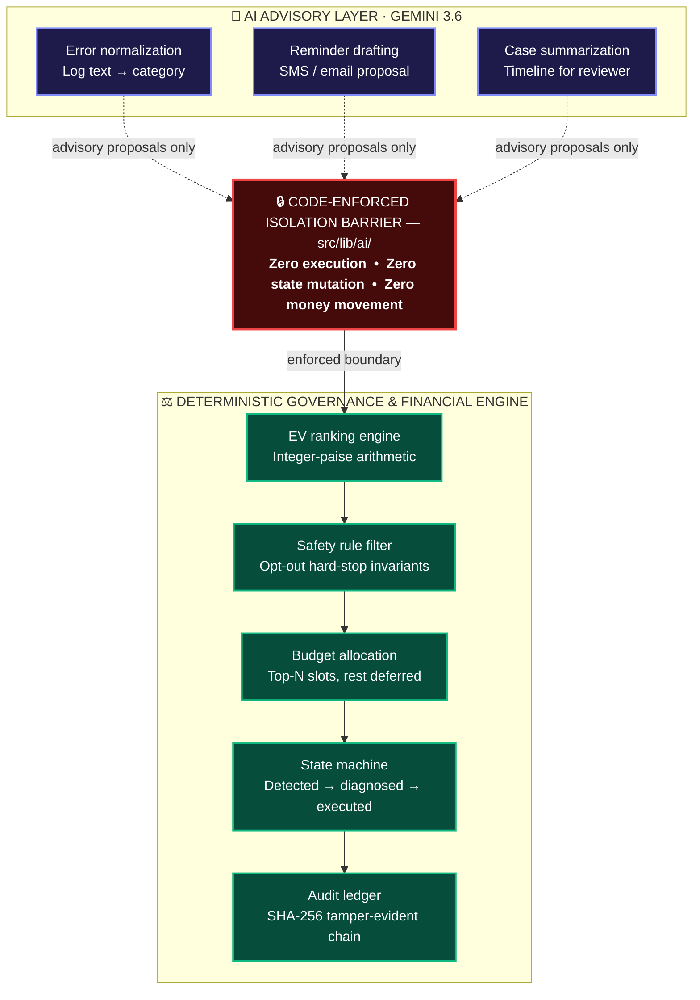

# PayBack AI — Strict AI vs Non-AI Responsibility Boundary

> **Submission Document**: Razorpay AI Buildathon · Track 3: AI Revenue Recovery  
> **Live Web Application**: [https://recoverflow-ai-kohl.vercel.app](https://recoverflow-ai-kohl.vercel.app)  
> **Repository**: [https://github.com/skmdshariff143-ai/recoverflow-ai](https://github.com/skmdshariff143-ai/recoverflow-ai)

---

## 1. Architectural Overview & Code-Enforced Isolation

Google Gemini 3.6 Flash operates strictly as an **advisory-only copilot** with **zero execution rights, zero state-mutation privileges, and zero money-movement authority**. All financial arithmetic, safety rule filters, budget allocations, multi-cycle state machine transitions, and cryptographic audit hashing are executed deterministically by pure TypeScript modules in [`src/lib/engine/`](../src/lib/engine/).

---

## 2. Responsibility Boundary Matrix

| Capability | Engine Mechanism | Responsible Layer | Code Location | AI Involvement |
|---|---|---|---|---|
| **Probability & EV Math** | Closed-form logistic logit & integer paise math | Deterministic Financial Core | `src/lib/engine/financial.ts` | **NONE** |
| **Eligibility & Opt-Outs** | Hard boolean predicate check | Deterministic Safety Filter | `src/lib/engine/safetyFilter.ts` | **NONE** |
| **Budget & Capacity Ranking** | EV sorting and capacity capping | Deterministic Prioritization | `src/lib/engine/rankAndAllocate.ts` | **NONE** |
| **State Machine Transitions** | Strict finite state transition matrix | Deterministic State Engine | `src/lib/engine/stateMachine.ts` | **NONE** |
| **Transaction Execution** | Adapter interface + idempotency store | Execution Boundary | `src/lib/adapters/` | **NONE** |
| **Error Log Categorization** | LLM classification with heuristic fallback | Bounded Gemini Copilot | `src/lib/ai/geminiClient.ts` | **ADVISORY ONLY** |
| **Message Drafting** | Policy-constrained template drafting | Bounded Gemini Copilot | `src/lib/ai/geminiClient.ts` | **ADVISORY ONLY** |
| **Audit Ledger Hashing** | SHA-256 cryptographic chain | Cryptographic Ledger Engine | `src/lib/engine/hashChainLedger.ts` | **NONE** |

