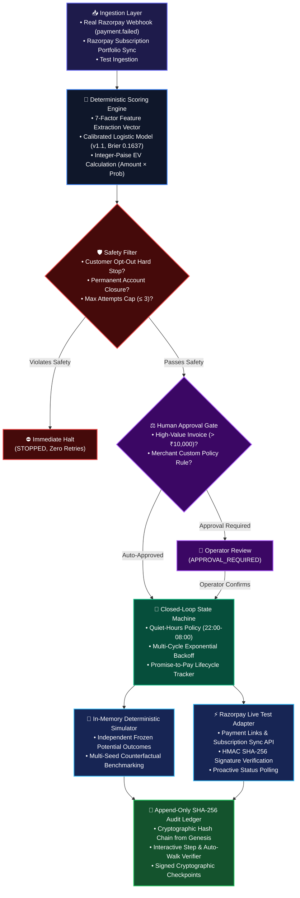
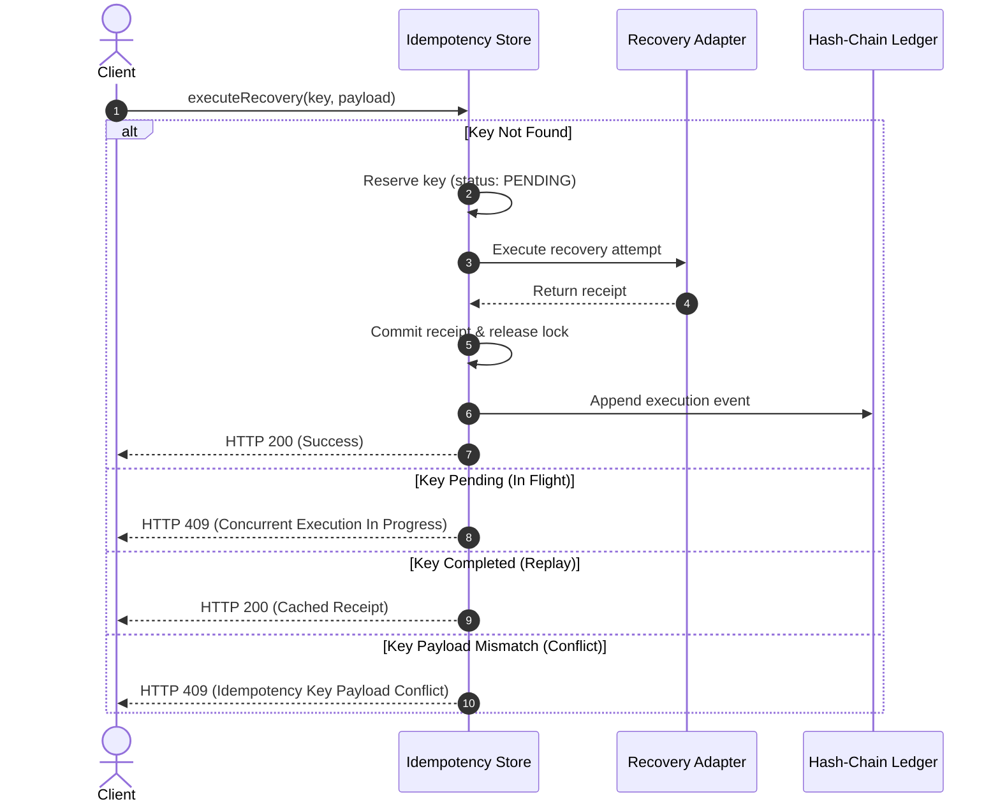

# RecoverFlow AI (PayBack AI) — System Architecture & Data Flow

> **Engineering Blueprint & Technical Specification**  
> *Production-oriented architecture for AI-assisted B2B payment recovery orchestration.*

---

## 1. Executive Summary & Design Philosophy

RecoverFlow AI is designed under a foundational premise:

> **AI may advise, classify, normalize, summarize, or draft communication, but AI must NEVER directly control financial execution, state transitions, idempotency, or ledger integrity.**

Every financial calculation, safety rule, state machine transition, and audit trail record is strictly deterministic and testable in pure TypeScript. Language models operate as bounded, advisory micro-services separated by typed interfaces and strict validation schemas.

---

## 2. End-to-End Pipeline Architecture



---

## 3. Component Hierarchy & Layering

```
src/
├── types/                # Branded nominal types (Paise, BasisPoints), domain error hierarchy, Zod schemas
├── lib/
│   ├── engine/           # Pure, deterministic core:
│   │   ├── financial.ts           # Integer-paise math, basis points, EV calculation
│   │   ├── safetyFilter.ts        # Hard boolean invariant checks
│   │   ├── rankAndAllocate.ts     # EV ranking & capacity allocation
│   │   ├── trainModel.ts          # Logistic regression, customer-disjoint split
│   │   ├── calibration.ts         # Brier score, ECE, MCE, log loss, reliability bins
│   │   ├── modelMonitoring.ts     # Population drift detection & alert levels
│   │   ├── stateMachine.ts        # Closed-loop recovery lifecycle
│   │   ├── quietHours.ts          # Local timezone blackout window scheduling
│   │   ├── approvalGate.ts        # High-value human-in-the-loop policies
│   │   └── hashChainLedger.ts     # SHA-256 tamper-evident hash chain & checkpoints
│   ├── adapters/         # External provider integrations:
│   │   ├── recoveryAdapter.ts     # Deterministic simulator & Razorpay test-mode adapter
│   │   ├── razorpaySubscriptionSync.ts # Live portfolio fetcher & parser
│   │   └── razorpayWebhook.ts     # HMAC SHA-256 signature verification
│   ├── ai/               # Bounded LLM advisory layer:
│   │   └── geminiClient.ts        # Error log normalization & reminder drafting (zero write rights)
│   ├── server/           # Server-side concurrency controls:
│   │   ├── idempotencyStore.ts    # Transactional reserveOrGet with 100-worker concurrency tests
│   │   └── rateLimiter.ts         # IP-based rate limiting
│   └── utils/            # Defensive utilities:
│       ├── sanitizeProviderError.ts # PII scrubbing (PAN, card numbers, tokens)
│       └── logger.ts              # Structured JSON logging
├── app/                  # Next.js App Router (UI pages & API route handlers)
└── components/           # Presentation layer (Queue, Drilldown Modal, Lab, Ledger)
```

---

## 4. State Machine Lifecycle & Transitions

The recovery lifecycle enforces strict monotonic progression. Unregistered or illegal transitions throw `InvalidTransitionError`:

```
[DETECTED] ──▶ [DIAGNOSED] ──▶ [SCHEDULED] ──▶ [EXECUTING] ──▶ [OUTCOME_OBSERVED] ──▶ [RECOVERED]
     │              │               │                                              ▲
     │ (Safety Halt)│ (Dispute)     │ (Approval Needed)                            │
     ▼              ▼               ▼                                              │
  [STOPPED]      [STOPPED]  [APPROVAL_REQUIRED] ──(Operator Approves)────────────────┘
```

| Source State | Trigger / Event | Destination State | Invariants Enforced |
|:---|:---|:---|:---|
| `DETECTED` | Ingestion complete | `DIAGNOSED` | Feature vector extracted; failure category assigned. |
| `DETECTED` | Opt-out / closure detected | `STOPPED` | Zero retries scheduled; stop reason permanently logged. |
| `DIAGNOSED` | EV calculated, safety passed | `SCHEDULED` | Scheduled outside customer quiet hours (22:00-08:00). |
| `DIAGNOSED` | Invoice > ₹10,000 | `APPROVAL_REQUIRED` | Execution blocked until human operator signs approval note. |
| `APPROVAL_REQUIRED` | Operator approves | `SCHEDULED` | Approval timestamp and operator ID recorded in audit ledger. |
| `APPROVAL_REQUIRED` | Operator rejects | `STOPPED` | Payment excluded from recovery schedule. |
| `SCHEDULED` | Dispatch execution | `EXECUTING` | Idempotency lock acquired; provider called. |
| `EXECUTING` | Adapter response received | `OUTCOME_OBSERVED` | Checksummed receipt generated; settled amount strictly 0 if link created. |
| `OUTCOME_OBSERVED` | Customer payment verified | `RECOVERED` | Verified against gateway API or frozen outcome matrix. |
| `OUTCOME_OBSERVED` | Failure, attempt < 3 | `SCHEDULED` | Exponential backoff delay applied ($2^n$ days). |
| `OUTCOME_OBSERVED` | Failure, attempt ≥ 3 | `STOPPED` | Max attempt cap reached. |

---

## 5. Idempotency Lifecycle & Concurrency Control

To prevent double-charging or duplicate payment links under concurrent network requests, RecoverFlow AI implements transactional reservation:



---

## 6. Core Architectural Invariants

| # | Invariant | Enforcement Mechanism | Failure Mode Prevented |
|---|---|---|---|
| **1** | **Integer-Paise Financial Math** | All arithmetic computed in minor units (integer paise) using basis points (`[0, 10000]`). | Floating-point rounding drift ($0.1 + 0.2 \neq 0.3$) across millions of ledger transactions. |
| **2** | **Evaluative Decoupling** | Ground-truth recovery outcomes are frozen in `data/frozen-outcomes-200.json` independently of model predictions. | Circular evaluation bias (evaluating a model against its own optimistic probabilities). |
| **3** | **Bounded AI Isolation** | Gemini 3.6 Flash inference is restricted to error taxonomy categorization and draft suggestions with zero state-mutation privileges. | Non-deterministic AI hallucinating money movements or unauthorized retries. |
| **4** | **Cryptographic Tamper-Evidence** | Every transaction is hashed with SHA-256 into an append-only chain $H_n = \text{SHA256}(H_{n-1} \parallel \text{Index}_n \parallel \text{Payload}_n)$. | Silent tampering, deletion, or reordering of audit events. |
| **5** | **Test-Mode Execution Barrier** | Razorpay key prefix validator enforces `rzp_test_*` and throws runtime exceptions on live keys. | Accidental live charges during evaluation or test runs. |

---

## 7. Path to Distributed Production (PostgreSQL & Redis)

In the current portfolio demonstration, concurrency and persistence are managed in-memory with TTL cleanup for zero-dependency execution. Below is the precise engineering specification for migrating to distributed enterprise production:

### 1. Atomic Idempotency via PostgreSQL
```sql
-- PostgreSQL Distributed Idempotency Table
CREATE TABLE idempotency_keys (
    key VARCHAR(255) PRIMARY KEY,
    request_hash VARCHAR(64) NOT NULL,
    status VARCHAR(32) NOT NULL CHECK (status IN ('PENDING', 'COMPLETED', 'FAILED')),
    response_payload JSONB,
    created_at TIMESTAMPTZ NOT NULL DEFAULT NOW(),
    expires_at TIMESTAMPTZ NOT NULL
);

-- Atomic Acquisition Query:
INSERT INTO idempotency_keys (key, request_hash, status, expires_at)
VALUES ($1, $2, 'PENDING', NOW() + INTERVAL '1 hour')
ON CONFLICT (key) DO NOTHING
RETURNING *;
```

### 2. Distributed Rate Limiting via Redis
Replace in-memory IP sliding windows with a Redis multi-key token bucket:
```lua
-- Atomic Token Bucket Script in Redis
local key = KEYS[1]
local limit = tonumber(ARGV[1])
local current = tonumber(redis.call('get', key) or "0")
if current + 1 > limit then
    return 0
else
    redis.call("INCRBY", key, 1)
    if current == 0 then
        redis.call("EXPIRE", key, 60)
    end
    return 1
end
```

### 3. Distributed Audit Ledger with KMS-Signed Checkpoints
- Persist hash-chained blocks into an append-only PostgreSQL table with a database rule preventing `UPDATE` and `DELETE`.
- Store signed periodic checkpoints in AWS KMS / GCP Cloud KMS with hardware security module (HSM) signing keys.

