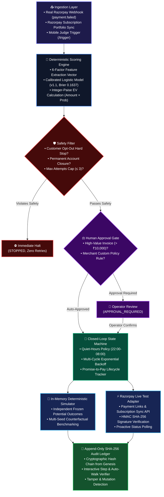

# PayBack AI — System Architecture & Data Flow

> **Submission Document**: Razorpay AI Buildathon · Track 3: AI Revenue Recovery  
> **Live Web Application**: [https://recoverflow-ai-kohl.vercel.app](https://recoverflow-ai-kohl.vercel.app)  
> **Repository**: [https://github.com/skmdshariff143-ai/recoverflow-ai](https://github.com/skmdshariff143-ai/recoverflow-ai)

---

## 1. End-to-End Pipeline Architecture (GitHub-Native Mermaid)



---

## 2. Decoupled Architectural Layering

```
e:\recoverflow-ai/
├── src/
│   ├── lib/
│   │   ├── engine/       # Framework-Agnostic Deterministic Core (Scoring, Safety, Ranking, State Machine, Ledger)
│   │   ├── adapters/     # Razorpay API, Subscription Sync, Webhook Ingestion, Recovery Execution
│   │   ├── ai/           # Bounded Gemini 3.6 Diagnostic Copilot (Advisory only; zero mutation rights)
│   │   ├── server/       # Server-Side In-Memory Stores (SubscriptionStore, WebhookStore, RateLimiter)
│   │   └── utils/        # Pure Math Utilities (Audio cues, fuzzy search, formatting)
│   ├── components/       # React Presentation Components (Command Center, Evaluation Lab, Audit Ledger)
│   ├── hooks/            # Typed React Hooks (useRecoveryBatch decoupling UI from engine)
│   ├── types/            # Strict TypeScript Interfaces & Zod Validation Schemas
│   └── app/              # Next.js App Router (UI Pages & REST API Route Handlers)
├── docs/                 # Architectural Blueprints, Evidence Logs, and Mathematical Proofs
├── tests/                # Automated Regression Suite (Unit Tests & Playwright E2E Multi-Viewport Tests)
├── scripts/              # Verification, Benchmark Generation, and Live Evidence Capture Scripts
└── data/                 # Immutable Frozen Ground-Truth Outcome Matrices & Benchmarks
```

---

## 3. Core Architectural Invariants

| # | Invariant | Enforcement Mechanism | Failure Mode Prevented |
|---|---|---|---|
| **1** | **Integer-Paise Financial Math** | All arithmetic computed in minor units (integer paise) using basis points (`[0, 10000]`). | Floating-point rounding drift ($0.1 + 0.2 \neq 0.3$) across millions of ledger transactions. |
| **2** | **Evaluative Decoupling** | Ground-truth recovery outcomes are frozen in `data/frozen-outcomes-200.json` independently of model predictions. | Circular evaluation bias (evaluating a model against its own optimistic probabilities). |
| **3** | **Bounded AI Isolation** | Gemini 3.6 Flash inference is restricted to error taxonomy categorization and draft suggestions with zero state-mutation privileges. | Non-deterministic AI hallucinating money movements or unauthorized retries. |
| **4** | **Cryptographic Tamper-Evidence** | Every transaction is hashed with SHA-256 into an append-only chain `H_n = \text{SHA256}(H_{n-1} \parallel \text{Record}_n)`. | Silent tampering, deletion, or reordering of audit events. |
| **5** | **Test-Mode Execution Barrier** | Razorpay key prefix validator enforces `rzp_test_*` and throws runtime exceptions on live keys. | Accidental live charges during evaluation or test runs. |

---

## 4. Cross-Reference Documentation Map

- **Model Mathematics & Calibration**: [`MODEL.md`](../MODEL.md)
- **Live Razorpay API Evidence**: [`docs/LIVE_RAZORPAY_EVIDENCE.md`](./LIVE_RAZORPAY_EVIDENCE.md)
- **Data Provenance & Frozen Outcomes**: [`docs/DATA_PROVENANCE.md`](./DATA_PROVENANCE.md)
- **Claim Reconciliation & Benchmark Proof**: [`docs/CLAIM_RECONCILIATION.md`](./CLAIM_RECONCILIATION.md)
- **Post-Mortem Incident Log**: [`docs/WHAT_BROKE.md`](./WHAT_BROKE.md)
- **Final Track 3 Proof Audit**: [`docs/FINAL_TRACK3_PROOF_AUDIT.md`](./FINAL_TRACK3_PROOF_AUDIT.md)
