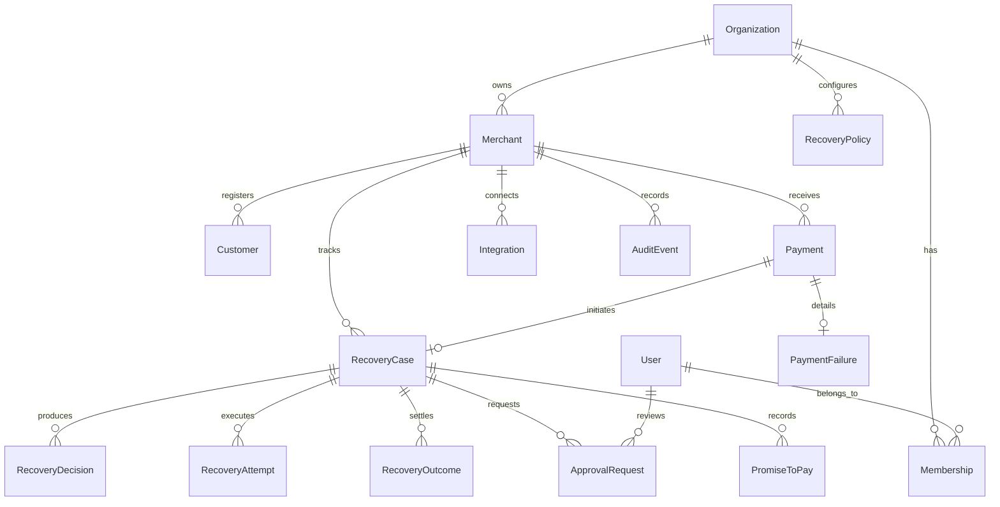

# RecoverFlow AI — Enterprise Database Architecture & Schema Specification

> **Engine**: PostgreSQL 16 (Durable Multi-Tenant Schema)  
> **ORM Layer**: Prisma 5.22.0  
> **Standard**: Normalized 3NF, Tenant-Scoped Foreign Keys, Composite Indexes, Cryptographic Integrity  

---

## 1. Schema Overview & Invariant Guarantees

The RecoverFlow AI database layer replaces in-memory prototype stores with a durable, multi-tenant relational persistence model supporting:
1. **Universal Tenant Scoping**: Every business record is scoped to an `Organization` and/or `Merchant`.
2. **Integer-Paise Financial Precision**: All money fields (`amountPaise`, `expectedValuePaise`, `recoveredAmountPaise`, `feeAmountPaise`, `highValueThresholdPaise`) use `BigInt` integer paise.
3. **Append-Only Cryptographic Audit Log**: State transitions link via SHA-256 HMAC hash chains.
4. **Zero State Loss**: Workflows and recovery cases survive container reboots and serverless cold starts.

---

## 2. Core Entity Relationship Diagram

---

## 3. Key Table Indexing & Query Patterns

### Multi-Tenant Scoping & Queries:
- `Payment`: `@@index([merchantId, status])`, `@@index([merchantId, createdAt])`
- `RecoveryCase`: `@@index([merchantId, status])`, `@@index([merchantId, nextAttemptScheduledAt])`
- `Customer`: `@@unique([merchantId, phone])`, `@@unique([merchantId, email])`
- `AuditEvent`: `@@index([merchantId, createdAt])`, `@@index([entityId, entityType])`
- `WebhookEvent`: `@@unique([idempotencyKey])`, `@@index([merchantId, source])`

### Migration & Seeding:
- Generated Prisma Client: `npx prisma generate --schema=packages/core/prisma/schema.prisma`
- Deterministic Seed Data: `npm run seed:demo` initializes demo datasets with zero external dependencies.
