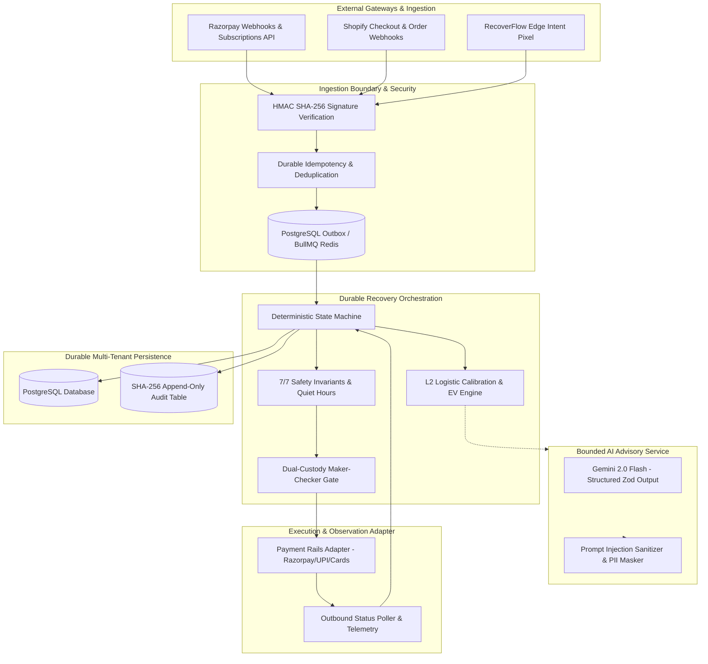

# RecoverFlow AI (PayBack AI) — Comprehensive Production Gap Analysis

> **Author**: Principal Full-Stack Engineer, FinTech Systems Architect, ML Engineer, Security Engineer & SRE  
> **Status**: APPROVED ARCHITECTURAL SPECIFICATION  
> **Repository**: [https://github.com/skmdshariff143-ai/recoverflow-ai](https://github.com/skmdshariff143-ai/recoverflow-ai)  
> **Target Standard**: Tier-1 FinTech Production & Enterprise Portfolio Quality  

---

## 1. Executive Summary

RecoverFlow AI (incorporating the PayBack AI engine) is an autonomous, explainable revenue recovery orchestration platform designed for high-volume merchants, subscription platforms, and direct-to-consumer businesses. 

While the project features exceptional algorithmic fundamentals—such as strict **integer-paise financial mathematics**, **L2-regularized logistic calibration**, a **frozen counterfactual evaluation harness**, an **append-only SHA-256 cryptographic audit trail**, and **dual-custody human governance**—it currently suffers from structural gaps typical of hackathon prototypes transitioning to production: in-memory state leakage, unauthenticated API surfaces, dual/conflicting brand terminology, uncoordinated webhook ingestion, and lack of durable workflow execution.

This document presents a rigorous, ground-truth gap analysis across all technical dimensions and outlines the target production architecture.

---

## 2. Current Architecture & Existing Strengths

```mermaid
flowchart TD
    subgraph ClientLayer [Client & Storefront Layer]
        ShopifyStore[Shopify / Headless Storefront]
        PixelSDK["@recoverflow/pixel (<4KB SDK)"]
        WebDashboard[Next.js 16 App Router Control Room]
    end

    subgraph APILayer [Next.js API Routes /apps/web]
        WebhookRazorpay[/api/webhooks/razorpay]
        WebhookShopify[/api/webhooks/shopify/*]
        RecoveryAPI[/api/recovery/*]
        DiagnosticsAPI[/api/ai/diagnose]
    end

    subgraph CoreEngine [Core Domain Engine /packages/core]
        FinancialMath[Integer-Paise Financial Engine]
        Calibration[L2 Logistic Calibration & Brier Score]
        SafetyFilter[7/7 Zero-Tolerance Safety Filters]
        ApprovalGate[Dual-Custody Human Approval Gate]
        HashLedger[SHA-256 Append-Only Hash Chain Ledger]
        QuietHours[TRAI/RBI Timezone-Aware Quiet Hours]
    end

    subgraph BoundedAI [Bounded Advisory AI /packages/agents]
        GeminiClient[Google Gemini 2.0 Flash Client]
        ZodValidator[Strict Zod Output Schemas]
        FallbackHeuristics[Deterministic Domain Heuristics]
    end

    subgraph StorageLayer [Current Storage State]
        MemoryDB[(In-Memory Maps & AtomicIdempotencyStore)]
        PrismaSchema[(Prisma Postgres Schema - Partial)]
    end

    ShopifyStore --> PixelSDK
    PixelSDK --> WebhookShopify
    WebDashboard --> RecoveryAPI
    WebhookRazorpay --> CoreEngine
    WebhookShopify --> CoreEngine
    CoreEngine --> BoundedAI
    CoreEngine --> StorageLayer
```

### Key Existing Strengths to Preserve
1. **Integer-Paise Financial Math**: All monetary amounts are stored and calculated strictly in integer paise ($1\text{ INR} = 100\text{ paise}$). Probabilities are converted to integer basis points ($10,000\text{ bps} = 100\%$) before calculating Expected Value ($\text{EV}_{\text{paise}} = \text{round}((\text{Amount} \times P_{\text{bps}})/10000)$), preventing IEEE-754 floating point drift.
2. **Strict AI Isolation Boundary**: The Large Language Model (Gemini) is isolated strictly as an **advisory and diagnostic service**. Gemini never executes payments, triggers retries, mutates account balances, modifies recovery state, or overrides safety gates.
3. **Independent Frozen Outcome Environment**: Model evaluation compares policies against a deterministic, counterfactual frozen ground-truth matrix, eliminating circular evaluation bias.
4. **Tamper-Evident SHA-256 Audit Trail**: Every state transition produces a cryptographic hash linked to the prior block's hash:
   $$\text{Hash}_n = \text{HMAC-SHA256}(\text{Secret}, \text{Hash}_{n-1} \parallel \text{EventPayload}_n)$$
5. **Zero-Tolerance Safety Controls**: Hard checks halt recovery for opted-out customers, unrecoverable technical/legal errors, quiet-hours windows (09:00–20:00 recipient local time), and high-value invoices (> ₹10,000) requiring human maker-checker signoff.

---

## 3. Comprehensive Gap Analysis

### 3.1 Data Persistence & State Management Gaps
- **Production Blocker**: In-memory Maps (`MemoryDatabase` in `packages/core/src/db.ts` and `AtomicIdempotencyStore`) lose state on serverless cold starts and container restarts.
- **Prisma vs Runtime Disconnect**: Prisma models exist in `packages/core/prisma/schema.prisma`, but several API routes write to in-memory `MemoryDatabase` or synthetic memory fixtures rather than executing transactional PostgreSQL queries.
- **Lack of Multi-Tenant Scoping**: Records lack universal, indexed `organizationId` and `merchantId` foreign keys with database-level row-level security (RLS) or repository-level tenant scoping.

### 3.2 Security & Authentication Gaps
- **No Session Authentication**: API routes under `/api/recovery/*` and `/api/webhooks/*` lack unified session validation, leaving dashboard operations unprotected.
- **Webhook Ingestion Divergence**:
  - Webhook routes verify HMAC signatures, but certain synthetic flows bypass HMAC verification in test mode without an explicit sandbox branch flag.
  - Replay attacks and duplicate webhook deliveries are handled in-memory rather than via durable distributed unique constraints on `(merchant_id, idempotency_key)`.
- **RBAC Absence**: No role-based access control exists to differentiate `OWNER`, `ADMIN`, `RECOVERY_MANAGER`, `ANALYST`, and `VIEWER`.

### 3.3 Reliability & Workflow Orchestration Gaps
- **In-Memory Timing / Lack of Durable Queuing**: Retries and quiet-hours delays in certain prototypes rely on in-process scheduling rather than a durable, distributed queue (e.g., BullMQ with Redis or Inngest/Trigger.dev).
- **Serverless Lifecycle Risk**: A Next.js API route executing multi-step recovery actions can be terminated midway by Vercel / serverless timeout, leaving recovery cases in an inconsistent state without two-phase commit or saga compensation.

### 3.4 AI/ML Operational & Governance Gaps
- **Hardcoded Model Names & Claims**: References across legacy docs mention disparate Gemini model versions (e.g., Gemini 1.5, 2.0 Flash, 3.x exploratory notes). Runtime configuration must resolve to a single canonical environment variable `GEMINI_MODEL=gemini-2.0-flash`.
- **Telemetry & Latency Tracking**: Token usage, prompt version, prompt injection sanitization, and fallback invocation latency are partially logged in unit tests but lack unified database-backed observability.

### 3.5 Brand & Architectural Naming Inconsistencies
- **Dual Brand Terminology**: The codebase contains references to both **RecoverFlow AI** (e-commerce cart/pixel recovery) and **PayBack AI** (fintech payment recovery engine). 
- **Resolution**: Consolidate primary branding as **RecoverFlow AI** ("Intelligent Revenue Recovery, Without Blind Retries"), maintaining PayBack AI as the internal deterministic financial core engine and Track 3 submission provenance.

### 3.6 Observability & SRE Gaps
- **Health & Readiness Probes**: Absence of standardized `/api/health` and `/api/ready` endpoints reporting PostgreSQL, Redis, and Gemini API connectivity.
- **Structured JSON Logging**: Logs currently use standard `console.log`/`console.error` rather than structured JSON logs with correlation IDs (`requestId`, `tenantId`, `traceId`).

---

## 4. Target Production Architecture



---

## 5. Migration Strategy & Zero-Regression Guardrails

1. **Step 1: P0 Schema & Persistence Normalization**:
   - Enhance Prisma schema with all 20+ required enterprise entities (`Organization`, `Merchant`, `User`, `Membership`, `RecoveryPolicy`, `Customer`, `Payment`, `PaymentFailure`, `RecoveryCase`, `RecoveryAttempt`, `RecoveryDecision`, `RecoveryOutcome`, `PromiseToPay`, `ApprovalRequest`, `WebhookEvent`, `Integration`, `AuditEvent`, `ModelPrediction`, `ModelVersion`, `Notification`, `IdempotencyKey`).
   - Provide database repository interfaces with transparent fallback to in-memory fixtures in `DEMO_MODE=true` so portfolio evaluators can test with 0 external infrastructure dependencies.

2. **Step 2: Dual Mode (DEMO vs LIVE) Architecture**:
   - In `DEMO_MODE=true`, the system initializes deterministic seed data (40 budget slots, seed 42, 100 benchmark payments, complete hash chain).
   - In `LIVE` mode, the system queries PostgreSQL and connects to live or sandbox Razorpay APIs with full multi-tenancy.

3. **Step 3: Webhook Unification & Deduplication**:
   - Establish a single authoritative webhook gateway route `/api/webhooks/razorpay` with strict signature verification, deduplication, and atomic outbox writes.

4. **Step 4: Full Quality Gate & Visual Regression**:
   - Maintain 100% pass rate across all 442+ unit/integration tests and 65+ Playwright E2E tests across desktop, tablet, and mobile.
