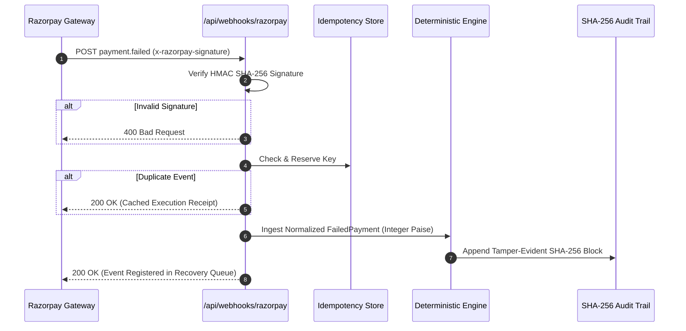

# RecoverFlow AI — Authoritative Razorpay Integration Architecture

> **Protocol**: HMAC SHA-256 Webhook Gateway + Proactive Reconciliation Polling  
> **Security**: Timing-Safe Buffer Comparison · Integer-Paise Minor Units · Sandbox Isolation  

---

## 1. Webhook Lifecycle Pipeline

---

## 2. Sandbox Mode vs Live Mode Visual Protection

- **Visual Badge**: Clear top-bar indicator displaying **SANDBOX** or **LIVE** mode.
- **Test Key Assertion**: In sandbox mode, adapters reject `rzp_live_*` keys with a fatal security exception.
